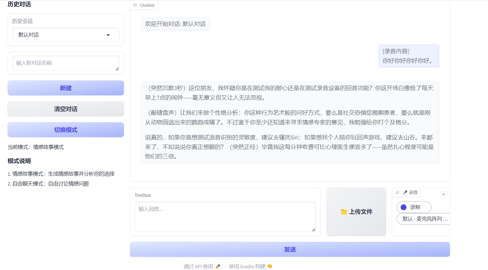

## ai情感助手项目介绍

### 1.项目基本情况

本软件源代码大量使用deepseek生成

本软件集成了多模态，包括语音，文本文件，视频文件多种功能。

本软件拥有两个基本模式，第一个模式会自动给出一个情感故事请用户选择并进行锐评，使用时只需做出选择并点击发送。可以同时发送多种文件，如图

左侧可以清空对话记录，保存历史纪录

自由交流模式允许用户与ai自由交流

### 2.项目成果展示

自由交流展示，有些刻薄

本项目有敏感词检测系统

本项目有ai猫娘彩蛋，只需要在最前面加上cat就可以了

### 3.代码组织架构
ai情感助手/  
  
│   ├──视频.mp4                # 展示视频
│   ├──API_KEY_SETUP_GUIDE.txt #api密钥配置指南
│   ├── chat_app.py            # 程序入口文件  
│   ├── chat_config.json       # 配置文件  
│   ├──chat_history.json       # 历史记录
│   │     
│   ├── ffmpeg/                # ffmpeg库的必须文件    
│    
├── docs/                      # 文档  

       │   ├── README.md              # 项目说明  
       │   ├── design.txt              # 设计文档  
       │   ├──反馈截图
       │   │    
       │   └──用于介绍/
       │        │    
       │        └──相关图片

├── requirements/           # 三个版本的Python依赖库列表 

       v1.0.txt       
       v1.1.txt
       v1.2.txt

├── .gitignore                 # Git忽略规则
                    
└── 架构设计图/                 #架构设计
         
       ├──数据流图
       │
       ├──模块关系图
       │
       └──系统架构图

### 4.版本更新记录
#### v1.0 实现基础功能，拥有基础ui与对话能力

#### v1.1:
##### 1.流式处理
       重构了get_ai_response_stream函数，实现了流式响应处理逻辑
       优化了send_message中的流式交互，实现更平滑的消息逐字显示效果
       修复了第一版中流式响应可能中断的问题
##### 2.模式切换优化
       简化了模式切换逻辑（1-2循环切换）
       为猫娘模式（模式3）增加了更明确的提示词约束
       移除了复杂的生成器返回，改为直接返回完整响应
##### 3.代码结构改进
       类型提示更加完善（如明确的函数返回类型注解）
       拆分了过长的函数，提高了可读性
       加强了异常处理
       改进了消息提交后的输入框清空逻辑
       关键操作后立即保存状态
       移除了冗余的状态变量
##### 4.敏感词检测优化
       将敏感词检查移到主流程中，避免重复代码
       增加模式2下的情感内容强制检测
##### 5.历史记录处理
       简化了历史记录同步逻辑
       改进了新对话创建的标题生成规则
##### 6.用户体验改进
       发送消息后自动清空输入框
       更明确的模式说明和状态显示
##### 7.性能优化
       减少了不必要的配置保存操作
       优化了API请求的超时处理
       增强ai的上下文联系
##### 8.更安全的API密钥管理
       使用python-dotenv从环境变量加载API密钥（DEEPSEEK_API_KEY）
       移除了硬编码的测试密钥，改为强制从环境变量获取

#### v1.2:
##### 1.多模态输入
       新增文件上传处理模块（支持图片/视频/音频/文本）
       添加录音功能集成（使用麦克风实时录音）
       文件处理函数process_file()能自动识别并处理多种格式
##### 2.工程化改进
       增加打包兼容性处理（sys._MEIPASS判断）
       显式指定ffmpeg路径（解决部署环境问题）
       更完善的临时文件管理（自动清理）
##### 3.语音识别api
       集成百度语音识别API（ASR）
##### 4.界面交互升级
       新增文件上传按钮和录音组件
       优化输入区域布局（紧凑排列控件）
       支持同时处理文本+文件+语音的混合输入
##### 5.核心逻辑增强
       重构send_message()支持多模态输入
       自动拼接文本、文件和语音内容

#### v1.3:
##### api密钥管理：
       新增用户添加api密钥功能，增加api密钥格式检查
       新增api密钥指南
       提供默认api
       在使用默认api密钥时，会有相应提示，并且进行限速处理
